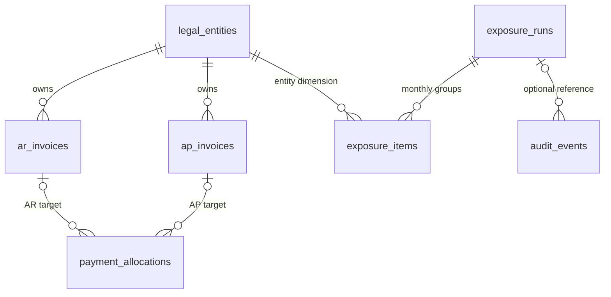

# ERP 資料表

```mermaid
erDiagram
    legal_entities ||--o{ ar_invoices : owns
    legal_entities ||--o{ ap_invoices : owns
    ar_invoices |o--o{ payment_allocations : "AR target"
    ap_invoices |o--o{ payment_allocations : "AP target"
    exposure_runs ||--o{ exposure_items : "monthly groups"
    legal_entities ||--o{ exposure_items : "entity dimension"
    exposure_runs |o--o{ audit_events : "optional reference"
```

付款配置透過生成欄位選擇 AR 或 AP 目標。複合外鍵要求付款的租戶、帳款 ID 與幣別一致。UUID 主鍵阻止重複寫入同一付款 identity。ERP 原始表與應用報表表有不同的 access roles。詳見 `src/erp_agent/database/tables.py`。
